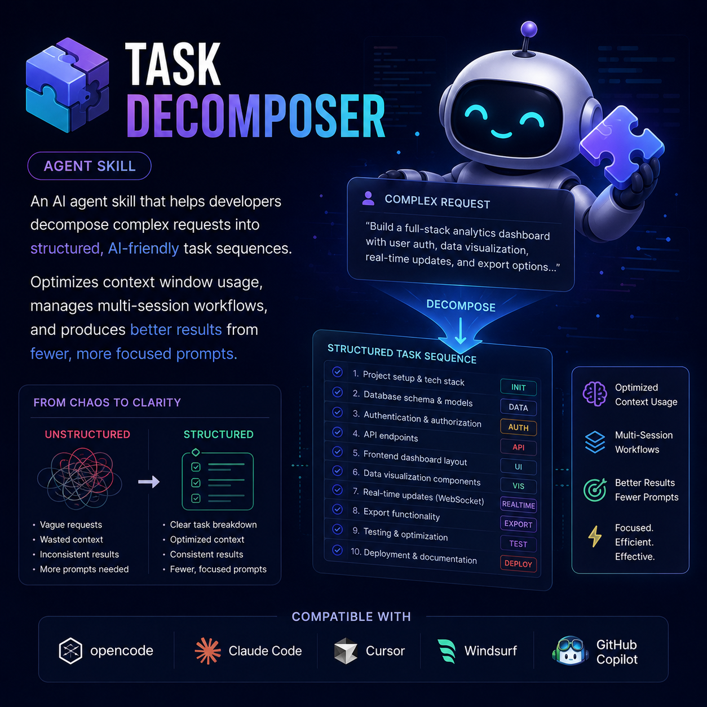

<div align="center">
  

# Task Decomposer

 [](https://awesome.re)
 [](https://github.com/sametcelikbicak/task-decomposer)

 </div>

An AI agent skill that helps developers decompose complex requests into structured, AI-friendly task sequences. Optimizes context window usage, manages multi-session workflows, and produces better results from fewer, more focused prompts. Compatible with opencode, Claude Code, Cursor, Windsurf, and GitHub Copilot.

## What it does

- **Goal Articulation** — clarifies vague requests into precise objectives
- **Dependency Mapping** — identifies the natural order of work across phases
- **Atomic Prompt Slicing** — breaks large work into standalone, verifiable prompt cards
- **Context Budget Planning** — manages context window limits with session handoffs
- **Execution Plans** — produces ordered, dependency-aware action plans the user can follow

## Install

```bash
# opencode — copy to project
cp -r task-decomposer .opencode/skills/

# or via agentskill.sh
/learn @sametcelikbicak/task-decomposer
```

## How it's different

Existing task-decomposition skills focus on **agent-to-agent** decomposition (AI breaks down work for itself or other agents). This one focuses on **human-to-AI** interaction — teaching the _developer_ how to structure their prompts and workflow for better AI collaboration.

## Usage scenarios

- [🇹🇷 Türkçe — Kullanım Senaryosu](USAGE_SCENARIO_TR.md)
- [🇬🇧 English — Usage Scenario](USAGE_SCENARIO_EN.md)

## License

MIT
